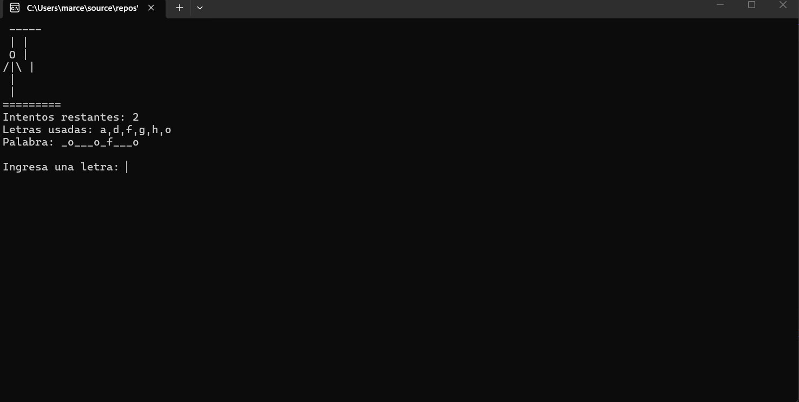

#  Ahorcado

##  ¿De qué trata?

Ahorcado es un juego desarrollado en consola con C#.  
El objetivo del jugador es adivinar una palabra secreta letra por letra antes de quedarse sin intentos.

Cada vez que el jugador falla una letra, el dibujo del ahorcado avanza hasta completar la figura. El juego termina cuando el jugador descubre toda la palabra o pierde todos sus intentos.


---

#  ¿Qué hicimos?

Durante el desarrollo del proyecto se implementaron:

- Sistema de palabras aleatorias.
- Registro de letras usadas.
- Detección de victoria y derrota.
- Dibujo progresivo del ahorcado.
- Interfaz visual en consola.
- Validación de letras repetidas.
- Sistema de reinicio de partida.
- Organización del proyecto usando múltiples clases.

También se aplicaron conceptos como:

- Encapsulamiento.
- Separación de lógica y presentación.
- Uso de colecciones.
- Manejo de ciclos y validaciones.

---

#  ¿Cómo funciona?

## Reglas del juego

1. El jugador debe ingresar letras desde el teclado.
2. Si la letra existe en la palabra:
   - se revela en pantalla.
3. Si la letra no existe:
   - se pierde un intento.
4. El jugador gana cuando descubre toda la palabra.
5. El jugador pierde cuando se completan todas las partes del ahorcado.

---

#  Controles

- Escribir una letra → intentar adivinar.
- S → volver a jugar.
- N → salir del juego.

---

#  Captura del juego

```markdown


---

#  Cláusula de IA

Este proyecto utilizó herramientas de inteligencia artificial como apoyo durante el desarrollo para:

- resolver dudas técnicas
- mejorar la interfaz visual
- detectar errores


