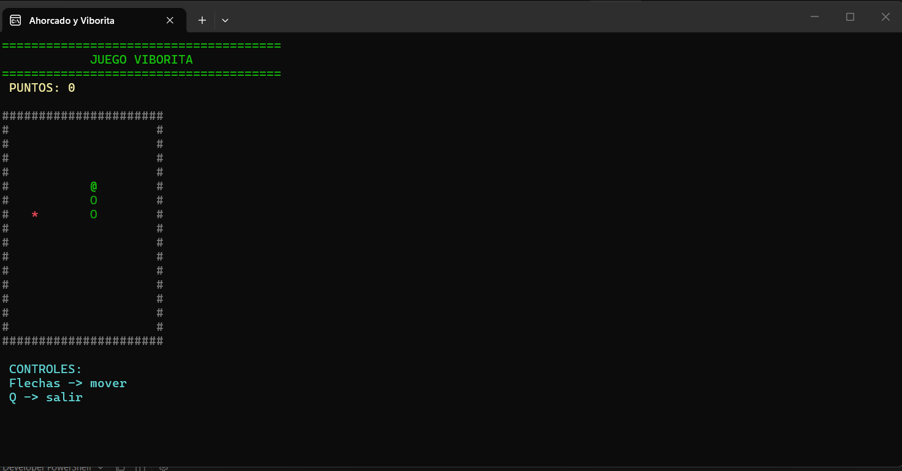

# README de la viborita
#  Viborita

##  ¿De qué trata?

Viborita es un juego desarrollado en consola con C#.  
El jugador controla una serpiente que debe moverse por el tablero y comer comida para ganar puntos y crecer. El objetivo es alcanzar 10 puntos sin chocar contra los bordes o contra sí misma.

---

#  ¿Qué hicimos?

Durante el desarrollo del proyecto se implementaron:

- Sistema de movimiento con teclado.
- Detección de colisiones.
- Generación de comida aleatoria.
- Sistema de puntos.
- Interfaz visual en consola.
- Menú principal para seleccionar juegos.
- Mejoras visuales usando colores y diseño ASCII.
- Organización del proyecto utilizando múltiples clases.

También se aplicaron conceptos como:

- Encapsulamiento.
- Separación de lógica y presentación.
- Uso de colecciones.
- Manejo de ciclos y eventos de teclado.

---

#  ¿Cómo funciona?

## Controles

- Flechas del teclado → mover la viborita.
- Q → salir del juego.

## Reglas

1. La viborita se mueve constantemente.
2. Al comer la comida (`*`) aumenta el puntaje.
3. La viborita crece conforme obtiene puntos.
4. El juego termina si:
   - choca con los bordes
   - choca contra sí misma
5. El jugador gana al llegar a 10 puntos.

---

## Captura del juego

---

#  Cláusula de IA

Durante el desarrollo del proyecto se utilizó inteligencia artificial como herramienta de apoyo para:

- mejorar la interfaz visual
- resolver errores
- recibir asistencia técnica

